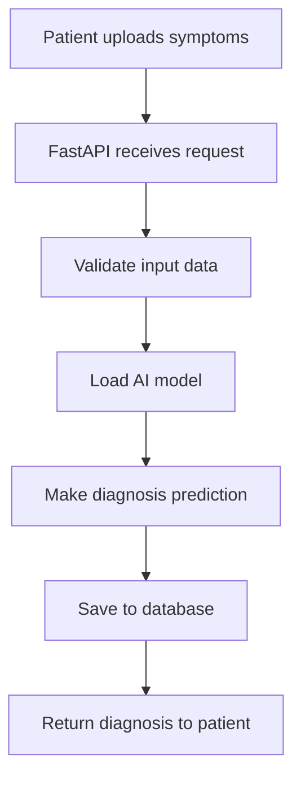

# 🐍 Python Learning Roadmap for AI Disease Diagnosis Project
*A step-by-step guide to understand this entire medical AI system*

## 🎯 Project Overview
This is an AI-powered medical diagnosis system that combines multiple technologies:
- **Web API Backend** (FastAPI + Python)
- **Machine Learning Models** (Random Forest, CNN)
- **Rule-based Expert Systems** 
- **Database Management** (MySQL + SQLAlchemy)
- **Web Frontend** (HTML, CSS, JavaScript)

---

## 📚 Learning Path: From Beginner to Medical AI Expert

### **Phase 1: Python Fundamentals (Week 1-2)**
*Master the building blocks before diving into medical AI*

#### Day 1-3: Core Python Concepts
```python
# Variables and Data Types
name = "Patient John"          # Strings for patient names
age = 35                       # Integers for age
temperature = 98.6             # Floats for medical measurements
symptoms = ["fever", "cough"]   # Lists for multiple symptoms

# Control Flow (Essential for medical logic)
if temperature > 100.4:
    risk_level = "High"
elif temperature > 99.5:
    risk_level = "Moderate" 
else:
    risk_level = "Normal"
```

**📖 Study Topics:**
- Variables, strings, numbers, lists, dictionaries
- If/elif/else statements (medical decision trees!)
- For loops (processing multiple patients)
- Functions (reusable medical calculations)

#### Day 4-7: Object-Oriented Programming
```python
# Classes represent medical entities
class Patient:
    def __init__(self, name, age, symptoms):
        self.name = name
        self.age = age
        self.symptoms = symptoms
    
    def assess_risk(self):
        # Medical risk assessment logic
        pass
```

**📖 Study Topics:**
- Classes and objects (Patient, Doctor, Diagnosis)
- Methods and attributes
- Inheritance (different types of medical models)

#### Day 8-14: Essential Libraries
```python
import pandas as pd     # Data manipulation (patient records)
import numpy as np      # Mathematical operations  
import json            # API data exchange
from datetime import datetime  # Tracking when diagnoses were made
```

### **Phase 2: Data Science Foundations (Week 3-4)**
*Learn to work with medical data like a data scientist*

#### Day 15-18: Pandas for Medical Data
```python
# Loading patient datasets
df = pd.read_csv('patient_symptoms.csv')

# Analyzing symptoms patterns
symptom_counts = df['symptoms'].value_counts()
age_groups = df.groupby('age_group')['disease'].value_counts()

# Cleaning medical data
df['temperature'] = pd.to_numeric(df['temperature'], errors='coerce')
df = df.dropna()  # Remove incomplete records
```

**🏥 Medical Context:**
- Patient records are often messy and need cleaning
- Group analysis helps find disease patterns
- Missing values are common in medical data

#### Day 19-25: NumPy for Medical Calculations
```python
# Normalize lab values for AI processing
platelets = np.array([150000, 200000, 100000])
normalized_platelets = platelets / 1000  # Scale down large numbers

# Calculate statistical measures
mean_age = np.mean(patient_ages)
temperature_std = np.std(temperatures)
```

#### Day 26-28: Data Visualization
```python
import matplotlib.pyplot as plt
import seaborn as sns

# Visualize disease distribution
plt.figure(figsize=(10, 6))
sns.countplot(data=df, x='disease')
plt.title('Disease Frequency in Our Dataset')
plt.show()
```

### **Phase 3: Machine Learning Basics (Week 5-6)**
*Understand how AI learns to diagnose diseases*

#### Day 29-32: Scikit-learn Fundamentals
```python
from sklearn.ensemble import RandomForestClassifier
from sklearn.model_selection import train_test_split
from sklearn.metrics import accuracy_score

# Prepare medical features
X = df[['fever', 'cough', 'fatigue', 'age', 'wbc_count']]
y = df['disease']

# Train-test split (some patients for training, others for testing)
X_train, X_test, y_train, y_test = train_test_split(X, y, test_size=0.2)

# Train the AI doctor
model = RandomForestClassifier(n_estimators=100)
model.fit(X_train, y_train)

# Make predictions
predictions = model.predict(X_test)
accuracy = accuracy_score(y_test, predictions)
```

**🤖 AI Context:**
- Random Forest = Multiple AI doctors voting on diagnosis
- Training data teaches the AI patterns
- Testing data checks if it learned correctly

#### Day 33-35: Feature Engineering
```python
# Create meaningful features from raw symptoms
df['has_respiratory_symptoms'] = df[['cough', 'shortness_of_breath']].any(axis=1)
df['fever_severity'] = df['temperature'].apply(lambda x: 'high' if x > 101 else 'normal')

# One-hot encoding for categorical symptoms
symptom_dummies = pd.get_dummies(df['primary_symptom'])
```

#### Day 36-42: Deep Learning Introduction
```python
import tensorflow as tf
from tensorflow.keras import layers

# Simple neural network for medical image analysis
model = tf.keras.Sequential([
    layers.Conv2D(32, 3, activation='relu', input_shape=(224, 224, 3)),
    layers.MaxPooling2D(),
    layers.Conv2D(64, 3, activation='relu'),
    layers.MaxPooling2D(),
    layers.Flatten(),
    layers.Dense(64, activation='relu'),
    layers.Dense(4, activation='softmax')  # 4 skin diseases
])
```

### **Phase 4: Web Development with FastAPI (Week 7-8)**
*Build the web API that serves medical diagnoses*

#### Day 43-46: FastAPI Basics
```python
from fastapi import FastAPI
from pydantic import BaseModel

app = FastAPI(title="Medical AI API")

class PatientSymptoms(BaseModel):
    symptoms: list
    age: int
    temperature: float

@app.post("/diagnose")
async def diagnose_patient(patient: PatientSymptoms):
    # Use AI model to make diagnosis
    diagnosis = ai_model.predict([patient.symptoms])
    return {"diagnosis": diagnosis, "confidence": 0.85}
```

#### Day 47-49: Request/Response Handling
```python
from fastapi import HTTPException, UploadFile, File

@app.post("/upload-medical-image")
async def upload_image(file: UploadFile = File(...)):
    if file.content_type not in ["image/jpeg", "image/png"]:
        raise HTTPException(status_code=400, detail="Invalid image format")
    
    # Save and process medical image
    diagnosis = cnn_model.predict_image(file)
    return diagnosis
```

#### Day 50-56: Database Integration
```python
from sqlalchemy import create_engine, Column, Integer, String
from sqlalchemy.ext.declarative import declarative_base
from sqlalchemy.orm import sessionmaker

# Patient database model
class Patient(Base):
    __tablename__ = "patients"
    
    id = Column(Integer, primary_key=True)
    name = Column(String(100))
    age = Column(Integer)
    diagnosis = Column(String(100))
```

### **Phase 5: Project Architecture Understanding (Week 9-10)**
*See how all pieces work together*

#### Day 57-60: Code Structure Analysis
```
backend/
├── main.py              # 🚀 App startup & configuration
├── models/              # 📊 Database table definitions  
├── routes/              # 🛤️ API endpoint handlers
├── ml/                  # 🧠 AI model implementations
├── services/            # ⚙️ Business logic
└── config.py            # ⚗️ Settings & parameters
```

#### Day 61-63: Request Flow Understanding


#### Day 64-70: Advanced Features
```python
# SHAP Explainability (Why did AI make this diagnosis?)
import shap

explainer = shap.TreeExplainer(random_forest_model)
shap_values = explainer.shap_values(patient_features)
# Shows which symptoms were most important for diagnosis

# Rule-based system combination
if ai_probability > 0.8 and 'fever' in symptoms and wbc_count > 10000:
    final_diagnosis = 'High confidence bacterial infection'
```

---

## 🎯 Project-Specific Learning Goals

### **Understanding This Medical AI System:**

#### **1. Multi-Modal Diagnosis Pipeline**
```python
# The system can diagnose from:
# 1. Symptoms + Lab values → Random Forest
# 2. Medical images → CNN  
# 3. Rule-based expert knowledge
# 4. Combined fusion approach
```

#### **2. Real-world Medical Considerations**
- **Data Privacy**: Patient information security
- **Accuracy Requirements**: Medical AI needs high precision
- **Explainability**: Doctors need to understand AI decisions
- **Risk Assessment**: Different urgency levels

#### **3. System Components You'll Recognize:**
```python
# After your studies, you'll understand:
@app.post("/api/v1/predict")  # API endpoint
async def predict_disease(    # Async for performance
    symptoms: SymptomsInput,  # Pydantic validation
    db: Session = Depends(get_db)  # Database dependency
):
    # Load trained model
    model = joblib.load('random_forest_model.pkl')
    
    # Prepare features
    features = prepare_features(symptoms.dict())
    
    # Make prediction
    prediction = model.predict_proba(features)
    
    # Explain decision with SHAP
    explanation = explainer.shap_values(features)
    
    return PredictionResponse(...)
```

---

## 📋 Weekly Study Plan

### **Week 1-2: Python Foundation**
- **Daily**: 2-3 hours coding practice
- **Projects**: Build simple calculator, patient data organizer
- **Goal**: Write clean, readable Python code

### **Week 3-4: Data Science**
- **Daily**: Work with medical datasets
- **Projects**: Analyze symptom patterns, create visualizations
- **Goal**: Load, clean, and analyze medical data

### **Week 5-6: Machine Learning**
- **Daily**: Train simple ML models
- **Projects**: Build symptom-to-disease predictor
- **Goal**: Understand how AI learns medical patterns

### **Week 7-8: Web Development**
- **Daily**: Build API endpoints
- **Projects**: Create medical diagnosis API
- **Goal**: Serve AI predictions via web interface

### **Week 9-10: Integration**
- **Daily**: Study this project's code
- **Projects**: Add features to the existing system
- **Goal**: Understand enterprise medical AI architecture

---

## 📚 Recommended Resources

### **Books:**
1. *"Python Crash Course"* - Eric Matthes
2. *"Hands-On Machine Learning"* - Aurélien Géron  
3. *"FastAPI: Modern Python Web Development"* - Bill Lubanovic

### **Online Courses:**
1. **Python**: Codecademy Python Course
2. **ML**: Andrew Ng's Machine Learning Course
3. **FastAPI**: FastAPI Official Tutorial

### **Practice Projects Before This One:**
1. **Simple symptom checker** (if/else logic)
2. **Patient database** (SQLAlchemy practice)  
3. **Basic ML model** (scikit-learn)
4. **Simple web API** (FastAPI basics)

---

## 🎉 Success Milestones

### **After Week 2:** You can write Python scripts to process patient data
### **After Week 4:** You can analyze medical datasets and find patterns  
### **After Week 6:** You can train AI models to make medical predictions
### **After Week 8:** You can build web APIs for medical applications
### **After Week 10:** You understand this entire project and can contribute to it!

---

## 🚀 Next Steps After Mastering This Project

1. **Add new diseases** to the diagnostic system
2. **Implement new ML algorithms** (XGBoost, Neural Networks)
3. **Build mobile app frontend** 
4. **Add real-time monitoring** features
5. **Contribute to open-source medical AI projects**

Remember: **Medical AI is about saving lives through technology!** 🏥💻❤️

Every line of code you write could potentially help doctors make better diagnoses and help patients get the care they need faster. That's the power and responsibility of medical AI development.

Happy learning, future medical AI developer! 🌟👩‍💻👨‍💻